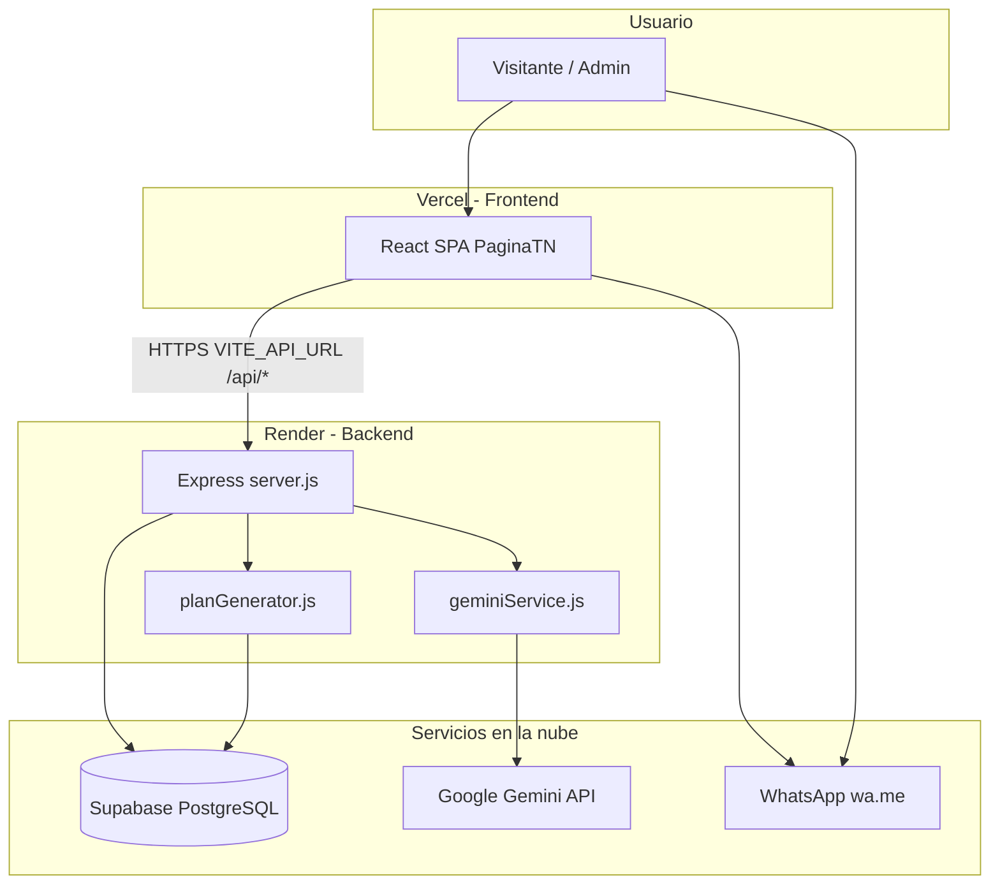
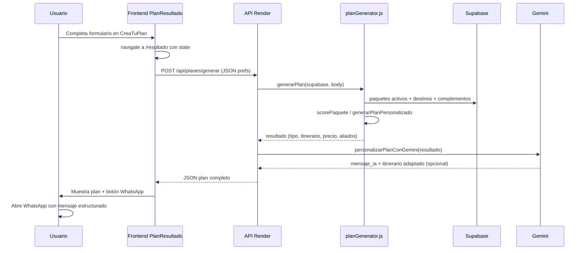

# Tours Naranja — Documentación final del proyecto

**Versión:** sitio web en producción (Vercel + Render + Supabase)  
**Contacto público:** toursnaranjasas@gmail.com · Instagram: [@toursnaranja](https://www.instagram.com/toursnaranja/)  
**WhatsApp:** +57 302 2266184  

---

## 1. Resumen ejecutivo

Tours Naranja es una plataforma web de turismo en **Montería y Córdoba (Colombia)**. Permite a los visitantes ver paquetes oficiales, leer el blog, contactar a la agencia y **armar un plan personalizado** (“Personaliza tu experiencia”). Los administradores gestionan catálogo, blog, galería de inicio y mensajes de contacto desde un panel privado.

La solución se divide en **tres capas** desplegadas por separado:

| Capa | Tecnología | Hosting |
|------|------------|---------|
| Frontend (web) | React 19 + Vite | Vercel |
| Backend (API) | Node.js + Express | Render |
| Base de datos | PostgreSQL vía Supabase | Supabase Cloud |
| IA (opcional) | Google Gemini API | Llamada desde el backend |

---

## 2. Estructura de carpetas del repositorio

```
Toursnaranja/
├── PaginaTN/                 # Frontend público + admin (React)
│   ├── public/               # Imágenes estáticas (logo, hero, galería, paquetes)
│   ├── src/
│   │   ├── pages/            # Pantallas por ruta
│   │   ├── components/       # UI reutilizable (Navbar, Footer, formularios, home)
│   │   ├── services/         # Llamadas al API (paquetes, blog, plan)
│   │   ├── lib/              # Utilidades (apiUrl, fetchJson, WhatsApp)
│   │   ├── config/           # Textos del sitio en español (site.js)
│   │   ├── i18n/             # Traducción inglés + UI
│   │   └── router.jsx        # Rutas de la aplicación
│   └── vercel.json           # SPA: todas las rutas → index.html
│
├── backend/                  # API REST
│   ├── server.js             # Rutas y arranque del servidor
│   ├── planGenerator.js      # Motor de recomendación (Personaliza)
│   ├── geminiService.js      # Integración Google Gemini
│   ├── supabaseClient.js     # Cliente Supabase
│   ├── middleware/authAdmin.js
│   ├── uploadPaqueteImagen.js / uploadGaleria.js
│   └── data/blog-posts.json  # Respaldo para importar blog
│
└── documentos/               # Documentación (este archivo)
```

---

## 3. Arquitectura tecnológica y conexiones

### 3.1 Diagrama general



### 3.2 Cómo se conectan en local

| Componente | Puerto / URL |
|------------|----------------|
| Frontend | `http://localhost:5173` (Vite) |
| Backend | `http://localhost:3001` |
| Proxy Vite | Las peticiones a `/api/*` se reenvían a `:3001` |

Comandos:

```bash
cd backend && npm install && npm run dev
cd PaginaTN && npm install && npm run dev
```

### 3.3 Cómo se conectan en producción

| Variable | Dónde | Función |
|----------|-------|---------|
| `VITE_API_URL` | Vercel | URL del backend Render (ej. `https://tours-naranja.onrender.com`) |
| `FRONTEND_URL` | Render | URL de Vercel para CORS |
| `SUPABASE_URL` / `SUPABASE_SERVICE_KEY` | Render | Acceso a la base de datos |
| `JWT_SECRET` | Render | Token del login admin |
| `GEMINI_API_KEY` | Render | Personaliza y chatbot con IA |

El frontend usa `src/lib/apiUrl.js`: si existe `VITE_API_URL`, todas las llamadas van al Render; si no, usa rutas relativas `/api` (solo desarrollo con proxy).

**Importante:** Los secretos **nunca** van en GitHub; solo en `.env` local y en el panel de Render/Vercel.

### 3.4 Flujo de una petición típica (ej. listar paquetes)

1. El usuario abre `https://tours-naranja.vercel.app/paquetes`.
2. React ejecuta `fetchPaquetes()` → `fetchJson('/api/paquetes')`.
3. `apiUrl` convierte la ruta en `https://tours-naranja.onrender.com/api/paquetes`.
4. Express consulta Supabase: tabla `paquetes` con `activo = true`.
5. El backend adjunta el nombre del destino y devuelve JSON.
6. La página muestra las tarjetas con fotos de `/public/paquetes/`.

---

## 4. Base de datos (Supabase) — tablas principales

| Tabla | Uso en el sistema |
|-------|-------------------|
| `destinos` | Lugares de Córdoba; formulario Personaliza y filtros |
| `paquetes` | Tours oficiales (Zenú, Sinú, Caribe, etc.) |
| `complementos` | Hoteles, restaurantes y extras por destino |
| `blog` | Artículos públicos del blog |
| `faq` | Preguntas del chatbot |
| `contactos` | Mensajes del formulario de contacto |
| `admin_users` | Login del panel administrador |
| `planes_generados` | Historial opcional de solicitudes Personaliza |

Relación conceptual: un **paquete** pertenece a un **destino**; los **complementos** se sugieren según destinos e intereses del cliente en Personaliza.

---

## 5. Módulos de la página (por sección)

### 5.1 Módulo Inicio (`/`)

**Archivos:** `Home.jsx`, componentes `home/*`, `site.js`.

**Funciones:**

- Hero con imagen `public/hero-home.png`.
- Bloques: presentación, paquetes destacados, galería (video + fotos), por qué elegirnos, cómo funciona, experiencia, ubicación/contacto.
- Formulario de contacto → `POST /api/contacto` → tabla `contactos`.
- Datos de paquetes desde `GET /api/paquetes` (no datos inventados en producción).

---

### 5.2 Módulo Paquetes (`/paquetes`, `/paquetes/:id`)

**Archivos:** `Paquetes.jsx`, `PaqueteDetalle.jsx`, `paquetesService.js`, `PackageCard.jsx`.

**Funciones:**

- Catálogo de tours activos desde Supabase.
- Detalle por ID con precio, descripción, incluye/no incluye.
- Botón WhatsApp con mensaje prellenado por paquete.
- Enlace a Personaliza para armar otro plan.

---

### 5.3 Módulo Sobre nosotros (`/sobre-nosotros`)

**Archivo:** `SobreNosotros.jsx`, textos en `site.js`.

Contenido institucional estático (historia, valores). Sin API propia.

---

### 5.4 Módulo Blog (`/blog`, `/blog/:slug`)

**Archivos:** `Blog.jsx`, `BlogDetalle.jsx`, `blogService.js`.

**API:**

- `GET /api/blog` — listado publicado.
- `GET /api/blog/:slug` — artículo.

**Admin:** CRUD en `/admin/blog` e importación desde `backend/data/blog-posts.json`.

---

### 5.5 Módulo Contacto

**Ruta:** `/contacto` redirige a `/#contacto` en inicio.

**Archivos:** `ContactForm.jsx`, `HomeLocation.jsx`, `Footer.jsx`.

- Correo mostrado: **toursnaranjasas@gmail.com** (`site.email`).
- Envío de mensaje → Supabase `contactos`.
- WhatsApp y redes (Instagram oficial).

---

### 5.6 Módulo Chatbot (FAQ + IA)

**Archivo:** `Chatbot.jsx`, `geminiService.js` (función `responderChatConFaq`).

1. Al abrir, carga `GET /api/faq`.
2. El usuario elige una pregunta o escribe texto libre.
3. Si hay `GEMINI_API_KEY`, `POST /api/ia/chat` envía la pregunta + FAQ a Gemini.
4. La IA responde **solo con base en la FAQ**; si no sabe, deriva a WhatsApp o Personaliza.
5. Botón directo a WhatsApp.

---

### 5.7 Módulo Administración (`/admin`)

**Protección:** JWT en `sessionStorage`; middleware `authAdmin.js` en rutas `/api/admin/*`.

| Pantalla | Función |
|----------|---------|
| Login | `POST /api/admin/login` |
| Dashboard | Resumen paquetes y contactos |
| Paquetes | CRUD + subida de imagen a `public/paquetes/` |
| Blog | CRUD + importar JSON |
| Galería | Subida video/fotos a `public/galeria/` |
| Contactos | Ver mensajes recibidos |

---

## 6. Módulo Personaliza tu experiencia (detalle completo)

Este es el **módulo central innovador** del proyecto: combina formulario web, **motor de reglas en el servidor**, datos reales de Supabase y **redacción opcional con Gemini**.

### 6.1 Rutas y pantallas

| Ruta | Componente | Rol |
|------|------------|-----|
| `/crea-tu-plan` | `CreaTuPlan.jsx` | Formulario de preferencias |
| `/crea-tu-plan/resultado` | `PlanResultado.jsx` | Muestra el plan y WhatsApp |

### 6.2 Datos que captura el formulario

| Campo | Descripción |
|-------|-------------|
| Destinos | IDs desde `GET /api/destinos` (multi-selección) |
| Ayuda para elegir | Si no sabe destino, el motor elige con más libertad |
| Presupuesto | Número en COP |
| Días | Entre 1 y 14 |
| Personas | 1, 2, 3, 4 o 5+ |
| Tipo de viaje | Pareja, familia, amigos, solo, etc. |
| Intereses | Cultura, naturaleza, aventura, gastronomía, etc. |
| Transporte / hospedaje / gastronomía aliados | Sí/No/según plan |
| Detalles adicionales | Texto libre |

Al enviar, **no llama al API aún**: guarda el objeto en el estado de React Router (`navigate(..., { state })`) y abre la página de resultado.

### 6.3 Flujo completo (paso a paso)



### 6.4 Motor de recomendación (`planGenerator.js`)

**No es un buscador genérico:** es un algoritmo de puntuación sobre los paquetes oficiales de la base de datos.

#### Paso A — Preparar preferencias

- Convierte personas (`5+` → 8 para cálculos de grupo).
- Obtiene nombres de destinos seleccionados.
- Infiere origen de salida para tour Zenú (Montería vs Lorica) según destinos.

#### Paso B — Cargar paquetes visibles

```text
SELECT * FROM paquetes WHERE activo = true AND visible_web = true
```

#### Paso C — Puntuar cada paquete (`scorePaquete`)

Criterios (resumen):

- Coincidencia de **días** pedidos vs días del paquete.
- Coincidencia de **destinos** (palabras clave: Zenú, Sinú, Caribe, etc.).
- Ajuste por **intereses** y tipo de viaje.
- **Presupuesto** vs precio estimado.
- Tamaño del **grupo**.

Umbral: **`SCORE_MIN_PAQUETE = 45`**. Si el mejor paquete supera 45 → se recomienda como **paquete oficial**.

#### Paso D — Si el score es bajo: plan personalizado

Se llama `generarPlanPersonalizado`:

- **No crea** un nuevo producto en la tabla `paquetes`.
- Construye un itinerario día a día con plantillas según intereses.
- Busca **complementos** (hoteles/restaurantes) en Supabase por destino.
- Estima precio orientativo (a veces basado en el paquete más cercano + extras).
- Mensaje claro: confirmación final por **WhatsApp** con un asesor humano.

#### Paso E — Estimación de precios

Reglas de negocio codificadas, por ejemplo:

- Tour Zenú: entrada por persona + transporte según tamaño de grupo y origen.
- Tour Sinú: precio por persona.
- Tour Caribe: puede requerir cotización (`precio` null).

### 6.5 Tipos de respuesta del API

| `tipo` | Significado |
|--------|-------------|
| `paquete_oficial` | El motor eligió un paquete del catálogo |
| `plan_personalizado` | Propuesta armada solo para este cliente |
| (histórico) `asesoria` | Variante de asesoría humana |

Campos importantes en la respuesta: `titulo`, `itinerario`, `precio_estimado`, `precio_nota`, `aliados`, `mensaje`, `mensaje_ia`, `gemini`, `preferencias`.

### 6.6 Capa de IA — Google Gemini (`geminiService.js`)

**Rol:** redacción y tono; **no** decide qué paquete ni inventa precios.

Condiciones:

- Requiere `GEMINI_API_KEY` en el backend.
- Se puede desactivar con `GEMINI_PERSONALIZA=false`.

Después de `generarPlan`:

1. `personalizarPlanConGemini(resultado)` envía un JSON con datos reales al modelo `gemini-2.0-flash`.
2. Reglas estrictas en el prompt: no inventar hoteles, no cambiar cifras, mismo número de días.
3. Devuelve `mensaje_ia` y puede reescribir textos de cada día del itinerario.
4. Si Gemini falla, el plan del motor de reglas **sigue mostrándose**.

### 6.7 Pantalla de resultado y WhatsApp

**Archivo:** `PlanResultado.jsx`, `whatsappPlanMessage.js`.

Al montar la página:

```javascript
fetchPlanFromApi(prefs)  // POST /api/planes/generar
```

Muestra:

- Resumen del plan (oficial o personalizado).
- Itinerario por días con aliados sugeridos.
- Precio orientativo y nota legal.
- Mensaje de IA si existe.
- Botón **“Confirmar con asesor por WhatsApp”** que abre `wa.me/573022266184` con un texto largo estructurado (destinos, días, precio, aliados, itinerario).

**Cierre comercial:** la reserva y el pago no son automáticos en la web; un asesor confirma por WhatsApp.

### 6.8 Endpoint técnico

```http
POST /api/planes/generar
Content-Type: application/json

{
  "destinosSeleccionados": [5, 6],
  "ayudaElegir": false,
  "presupuesto": 800000,
  "dias": 3,
  "personas": "2",
  "tipoViaje": "pareja",
  "intereses": ["Naturaleza", "Gastronomía"],
  "necesitaTransporte": "si",
  "hospedaje": "si",
  "gastronomiaAliados": "si",
  "detallesAdicionales": "..."
}
```

Validaciones en servidor: días 1–14, al menos un interés, destinos o “ayuda a elegir”, presupuesto y personas obligatorios.

### 6.9 Historial opcional

Si en Render está `GUARDAR_PLANES_SOLICITUDES=true`, cada generación puede guardarse en `planes_generados` para revisión en admin. Por defecto no es obligatorio.

---

## 7. API REST — resumen de endpoints

### Públicos (sin login)

| Método | Ruta | Descripción |
|--------|------|-------------|
| GET | `/api/health` | Estado del servidor |
| GET | `/api/destinos` | Destinos activos |
| GET | `/api/paquetes` | Catálogo web |
| GET | `/api/paquetes/:id` | Detalle paquete |
| GET | `/api/blog` | Listado blog |
| GET | `/api/blog/:slug` | Artículo |
| GET | `/api/faq` | FAQ chatbot |
| POST | `/api/contacto` | Formulario contacto |
| POST | `/api/planes/generar` | **Personaliza** |
| POST | `/api/ia/chat` | Chatbot con Gemini |

### Admin (header `Authorization: Bearer <token>`)

| Método | Ruta | Descripción |
|--------|------|-------------|
| POST | `/api/admin/login` | Login |
| GET/POST/PUT/PATCH | `/api/admin/paquetes` | Gestión paquetes |
| POST | `/api/admin/upload/paquete-imagen` | Subir foto paquete |
| GET/POST/PUT/DELETE | `/api/admin/blog` | Gestión blog |
| POST | `/api/admin/upload/galeria` | Subir galería inicio |
| GET | `/api/admin/contactos` | Ver contactos |

---

## 8. Internacionalización y contenido

- **Español:** `config/site.js`, `i18n/ui.es.js`.
- **Inglés:** `i18n/site.en.js`, `i18n/ui.en.js`.
- Componente `LanguageContext` envuelve la app.
- Correo y redes se configuran en `site.js` / `site.en.js`.

---

## 9. Diseño responsive

- Viewport en `index.html`.
- Menú hamburguesa desde 960px (`App.css`).
- Archivo `responsive.css`: grids a 1 columna, footer, detalle de paquete, Personaliza y formularios en móvil.
- Grids `grid-3` adaptados en `index.css`.

---

## 10. Despliegue y mantenimiento

| Acción | Dónde |
|--------|-------|
| Subir código | GitHub `danielaing16/tours-naranja` |
| Deploy frontend | Vercel (carpeta `PaginaTN`) |
| Deploy API | Render (carpeta `backend`) |
| Datos y SQL | Panel Supabase |
| Cambiar textos públicos | `PaginaTN/src/config/site.js` |
| Cambiar reglas de precios/score Personaliza | `backend/planGenerator.js` |
| Activar/desactivar IA | `GEMINI_API_KEY` / `GEMINI_PERSONALIZA` |

**No subir a Git:** `.env`, `node_modules`, `dist`, claves secretas.

---

## 11. Glosario rápido

| Término | Significado en este proyecto |
|---------|----------------------------|
| Paquete oficial | Tour publicado en catálogo (`paquetes`) |
| Plan personalizado | Propuesta generada solo para un cliente; no es un producto nuevo en BD |
| Score | Puntuación 0–100+ para elegir el mejor paquete |
| Aliado | Hotel o restaurante en `complementos` |
| Precio orientativo | Referencia; cotización final por WhatsApp |
| Gemini | IA de Google usada para redactar, no para calcular precios |

---

*Documento generado para informe académico / entrega final del proyecto Tours Naranja.*
